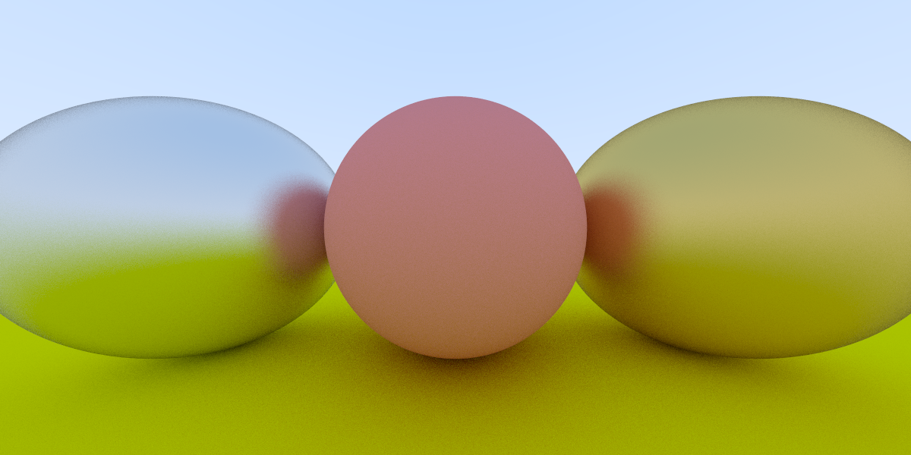
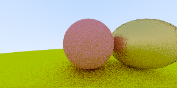

# raytracing_black_hole
C++ Project To Ray Trace a Black Hole

Ray Tracing in a Weekend Result with Multithreading:

With Simple First Order Euler Flat Space Rework:

With Runge Kutta Flat Space Rework:

